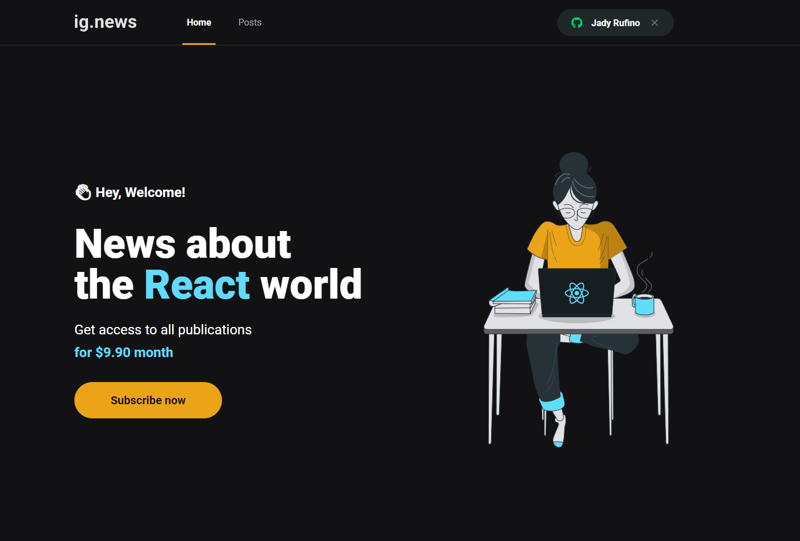

   

 

> <b>ig.news</b> Is an app that consists of a blog where to read a post you must be a subscriber, and the [Stripe](https://stripe.com/) API is used for payment control and saving subscriber data in FaunaDB.

 

## 📸 screenshot

  
  

 

# :computer: Technologies

This app was set up wth following technologies:

- [React](https://reactjs.org/)
- [Typescript](https://www.typescriptlang.org/)
- [NextJS](https://nextjs.org/)
- [FaunaDB](https://fauna.com/)'
- [Axios](https://github.com/axios/axios)
- [Stripe](https://stripe.com/)
- [Sass](https://sass-lang.com/)
